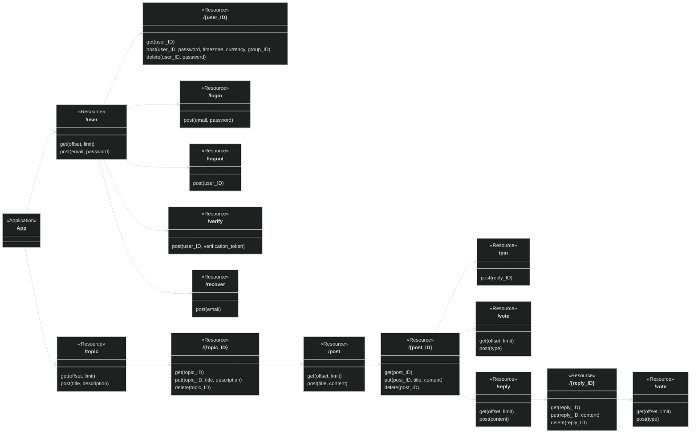

```mermaid
%%{init:{'theme':'dark'}}%%
classDiagram
direction LR

class App {
    <<Application>>
}

class User["/user"] {
    <<Resource>>
    get(offset, limit)
    post(email, password)
}

class User_ID["/{user_ID}"] {
    <<Resource>>
    get(user_ID)
    post(user_ID, password, timezone, currency, group_ID)
    delete(user_ID, password)
}

class User_login["/login"] {
    <<Resource>>
    post(email, password)
}

class User_logout["/logout"] {
    <<Resource>>
    post(user_ID)
}

class User_verify["/verify"] {
    <<Resource>>
    post(user_ID, verification_token)
}

class User_recover["/recover"] {
    <<Resource>>
    post(email)
}

App --> User
User --> User_ID
User --> User_login
User --> User_logout
User --> User_verify
User --> User_recover

class Topic["/topic"] {
    <<Resource>>
    get(offset, limit)
    post(title, description)
}

class Topic_ID["/{topic_ID}"] {
    <<Resource>>
    get(topic_ID)
    put(topic_ID, title, description)
    delete(topic_ID)
}

class Post["/post"] {
    <<Resource>>
    get(offset, limit)
    post(title, content)
}

class Post_ID["/{post_ID}"] {
    <<Resource>>
    get(post_ID)
    put(post_ID, title, content)
    delete(post_ID)
}

class Post_pin["/pin"] {
    <<Resource>>
    post(reply_ID)
}

class Post_vote["/vote"] {
    <<Resource>>
    get(offset, limit)
    post(type)
}

class Reply["/reply"] {
    <<Resource>>
    get(offset, limit)
    post(content)
}

class Reply_ID["/{reply_ID}"] {
    <<Resource>>
    get(reply_ID)
    put(reply_ID, content)
    delete(reply_ID)
}

class Reply_vote["/vote"] {
    <<Resource>>
    get(offset, limit)
    post(type)
}

App --> Topic
Topic --> Topic_ID
Topic_ID --> Post
Post --> Post_ID
Post_ID --> Post_pin
Post_ID --> Post_vote
Post_ID --> Reply
Reply --> Reply_ID
Reply_ID --> Reply_vote 
```