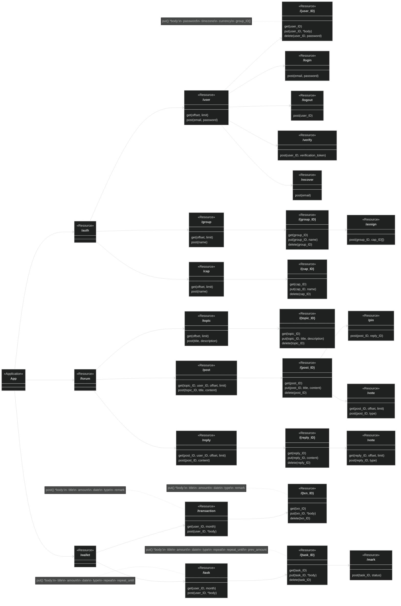

```mermaid
%%{init:{'theme':'dark'}}%%
classDiagram
direction LR

class App {
    <<Application>>
}

class Auth["/auth"] {
    <<Resource>>
}

class User["/user"] {
    <<Resource>>
    get(offset, limit)
    post(email, password)
}

class User_ID["/{user_ID}"] {
    <<Resource>>
    get(user_ID)
    put(user_ID, *body)
    delete(user_ID, password)
}

note for User_ID "put() *body:\n- password\n- timezone\n- currency\n- group_ID[]"

class User_login["/login"] {
    <<Resource>>
    post(email, password)
}

class User_logout["/logout"] {
    <<Resource>>
    post(user_ID)
}

class User_verify["/verify"] {
    <<Resource>>
    post(user_ID, verification_token)
}

class User_recover["/recover"] {
    <<Resource>>
    post(email)
}

App --> Auth
Auth --> User
User --> User_ID
User --> User_login
User --> User_logout
User --> User_verify
User --> User_recover

class Group["/group"] {
    <<Resource>>
    get(offset, limit)
    post(name)
}

class Group_ID["/{group_ID}"] {
    <<Resource>>
    get(group_ID)
    put(group_ID, name)
    delete(group_ID)
}

class Group_assign["/assign"] {
    <<Resource>>
    post(group_ID, cap_ID[])
}

class Capability["/cap"] {
    <<Resource>>
    get(offset, limit)
    post(name)
}

class Capability_ID["/{cap_ID}"] {
    <<Resource>>
    get(cap_ID)
    put(cap_ID, name)
    delete(cap_ID)
}

Auth --> Group
Group --> Group_ID
Group_ID --> Group_assign
Auth --> Capability
Capability --> Capability_ID

class Forum["/forum"] {
    <<Resource>>
}

class Topic["/topic"] {
    <<Resource>>
    get(offset, limit)
    post(title, description)
}

class Topic_ID["/{topic_ID}"] {
    <<Resource>>
    get(topic_ID)
    put(topic_ID, title, description)
    delete(topic_ID)
}

class Post["/post"] {
    <<Resource>>
    get(topic_ID, user_ID, offset, limit)
    post(topic_ID, title, content)
}

class Post_ID["/{post_ID}"] {
    <<Resource>>
    get(post_ID)
    put(post_ID, title, content)
    delete(post_ID)
}

class Post_pin["/pin"] {
    <<Resource>>
    post(post_ID, reply_ID)
}

class Post_vote["/vote"] {
    <<Resource>>
    get(post_ID, offset, limit)
    post(post_ID, type)
}

class Reply["/reply"] {
    <<Resource>>
    get(post_ID, user_ID, offset, limit)
    post(post_ID, content)
}

class Reply_ID["/{reply_ID}"] {
    <<Resource>>
    get(reply_ID)
    put(reply_ID, content)
    delete(reply_ID)
}

class Reply_vote["/vote"] {
    <<Resource>>
    get(reply_ID, offset, limit)
    post(reply_ID, type)
}

App --> Forum
Forum --> Topic
Topic --> Topic_ID
Forum --> Post
Post --> Post_ID
Post_ID --> Post_pin
Post_ID --> Post_vote
Forum --> Reply
Reply --> Reply_ID
Reply_ID --> Reply_vote 

class Wallet["/wallet"] {
    <<Resource>>
}

class Transaction["/transaction"] {
    <<Resource>>
    get(user_ID, month)
    post(user_ID, *body)
}

note for Transaction "post() *body:\n- title\n- amount\n- date\n- type\n- remark"

class Transaction_ID["/{txn_ID}"] {
    <<Resource>>
    get(txn_ID)
    put(txn_ID, *body)
    delete(txn_ID)
}

note for Transaction_ID "put() *body:\n- title\n- amount\n- date\n- type\n- remark"

App --> Wallet
Wallet --> Transaction
Transaction --> Transaction_ID

class Task["/task"] {
    <<Resource>>
    get(user_ID, month)
    post(user_ID, *body)
}

note for Task "put() *body:\n- title\n- amount\n- date\n- type\n- repeat\n- repeat_until"

class Task_ID["/{task_ID}"] {
    <<Resource>>
    get(task_ID)
    put(task_ID, *body)
    delete(task_ID)
}

note for Task_ID "put() *body:\n- title\n- amount\n- date\n- type\n- repeat\n- repeat_until\n- prev_amount"

class Task_mark["/mark"] {
    <<Resource>>
    post(task_ID, status)
}

Wallet --> Task
Task --> Task_ID
Task_ID --> Task_mark
```