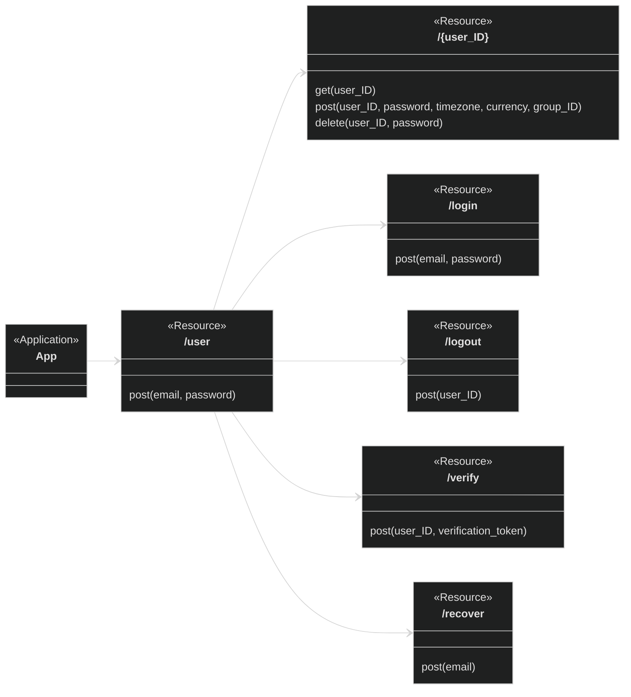

```mermaid
%%{init:{'theme':'dark'}}%%
classDiagram
direction LR

class App {
    <<Application>>
}

class User["/user"] {
    <<Resource>>
    post(email, password)
}

class User_ID["/{user_ID}"] {
    <<Resource>>
    get(user_ID)
    post(user_ID, password, timezone, currency, group_ID)
    delete(user_ID, password)
}

class User_login["/login"] {
    <<Resource>>
    post(email, password)
}

class User_logout["/logout"] {
    <<Resource>>
    post(user_ID)
}

class User_verify["/verify"] {
    <<Resource>>
    post(user_ID, verification_token)
}

class User_recover["/recover"] {
    <<Resource>>
    post(email)
}

App --> User
User --> User_ID
User --> User_login
User --> User_logout
User --> User_verify
User --> User_recover
```