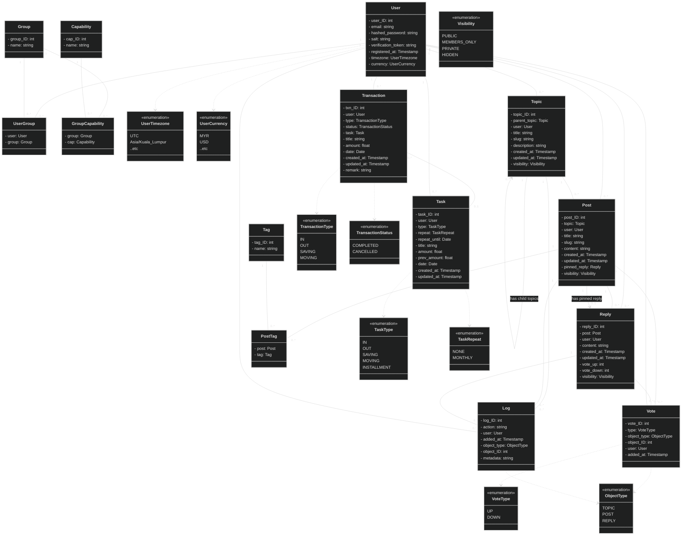

```mermaid
%%{init:{'theme':'dark'}}%%
classDiagram

%% Users & groups

class User {
    - user_ID: int
    - email: string
    - hashed_password: string
    - salt: string
    - verification_token: string
    - registered_at: Timestamp
    - timezone: UserTimezone
    - currency: UserCurrency
}

class Group {
    - group_ID: int
    - name: string
}

class Capability {
    - cap_ID: int
    - name: string
}

class UserGroup {
    - user: User
    - group: Group
}

class GroupCapability {
    - group: Group
    - cap: Capability
}

class UserTimezone {
    <<enumeration>>
    UTC
    Asia/Kuala_Lumpur
    ..etc
}

class UserCurrency {
    <<enumeration>>
    MYR
    USD
    ..etc
}

User "1" -- "0..*" UserGroup
Group "1" -- "0..*" UserGroup
Group "1" -- "0..*" GroupCapability
Capability "1" -- "0..*" GroupCapability
User ..> UserTimezone
User ..> UserCurrency

%% Forum, for knowledge base & customer support

class Topic {
    - topic_ID: int
    - parent_topic: Topic
    - user: User
    - title: string
    - slug: string
    - description: string
    - created_at: Timestamp
    - updated_at: Timestamp
    - visibility: Visibility
}

class Post {
    - post_ID: int
    - topic: Topic
    - user: User
    - title: string
    - slug: string
    - content: string
    - created_at: Timestamp
    - updated_at: Timestamp
    - pinned_reply: Reply
    - visibility: Visibility
}

class Reply {
    - reply_ID: int
    - post: Post
    - user: User
    - content: string
    - created_at: Timestamp
    - updated_at: Timestamp
    - vote_up: int
    - vote_down: int
    - visibility: Visibility
}

class Tag {
    - tag_ID: int
    - name: string
}

class PostTag {
    - post: Post
    - tag: Tag
}

class Vote {
    - vote_ID: int
    - type: VoteType
    - object_type: ObjectType
    - object_ID: int
    - user: User
    - added_at: Timestamp 
}

class VoteType {
    <<enumeration>>
    UP
    DOWN
}

class Visibility {
    <<enumeration>>
    PUBLIC
    MEMBERS_ONLY
    PRIVATE
    %% private = draft, read/write by author only
    HIDDEN
    %% hidden = hidden from public / members_only, moderated by admin
}

class Log {
    - log_ID: int
    - action: string
    - user: User
    - added_at: Timestamp
    - object_type: ObjectType
    - object_ID: int
    - metadata: string 
}

class ObjectType {
    <<enumeration>>
    TOPIC 
    POST 
    REPLY
}

User "1" -- "0..*" Topic
User "1" -- "0..*" Post
User "1" -- "0..*" Reply
Topic "1" --> "0..*" Topic: has child topics
Topic "1" -- "0..*" Post
Post "1" -- "0..*" Reply
Post "1" --> "0..1" Reply: has pinned reply 
Post "1" -- "0..*" PostTag
Tag "1" -- "0..*" PostTag
Topic "1" -- "0..*" Log
Post "1" -- "0..*" Log
Reply "1" -- "0..*" Log
User "1" -- "0..*" Log
Post "1" -- "0..*" Vote
Reply "1" -- "0..*" Vote
User "1" -- "0..*" Vote
Vote ..> VoteType
Vote ..> ObjectType
Log ..> ObjectType

%% Transaction records

class Transaction {
    - txn_ID: int
    - user: User
    - type: TransactionType
    - status: TransactionStatus
    - task: Task
    - title: string
    - amount: float
    - date: Date
    - created_at: Timestamp
    - updated_at: Timestamp
    - remark: string
}

class TransactionType {
    <<enumeration>>
    IN
    OUT
    SAVING
    MOVING
}

class TransactionStatus {
    <<enumeration>>
    COMPLETED
    CANCELLED
}

Transaction ..> TransactionType
Transaction ..> TransactionStatus
Transaction "0..*" -- "0..1" Task
User "1" -- "0..*" Transaction

%% Task (Todo list / Scheduled transaction)

class Task {
    - task_ID: int
    - user: User
    - type: TaskType
    - repeat: TaskRepeat
    - repeat_until: Date
    - title: string
    - amount: float
    - prev_amount: float
    - date: Date
    - created_at: Timestamp
    - updated_at: Timestamp
}

class TaskType {
    <<enumeration>>
    IN
    OUT
    SAVING
    MOVING
    INSTALLMENT
}

class TaskRepeat {
    <<enumeration>>
    NONE
    MONTHLY
}

Task ..> TaskType
Task ..> TaskRepeat
User "1" -- "0..*" Task
```